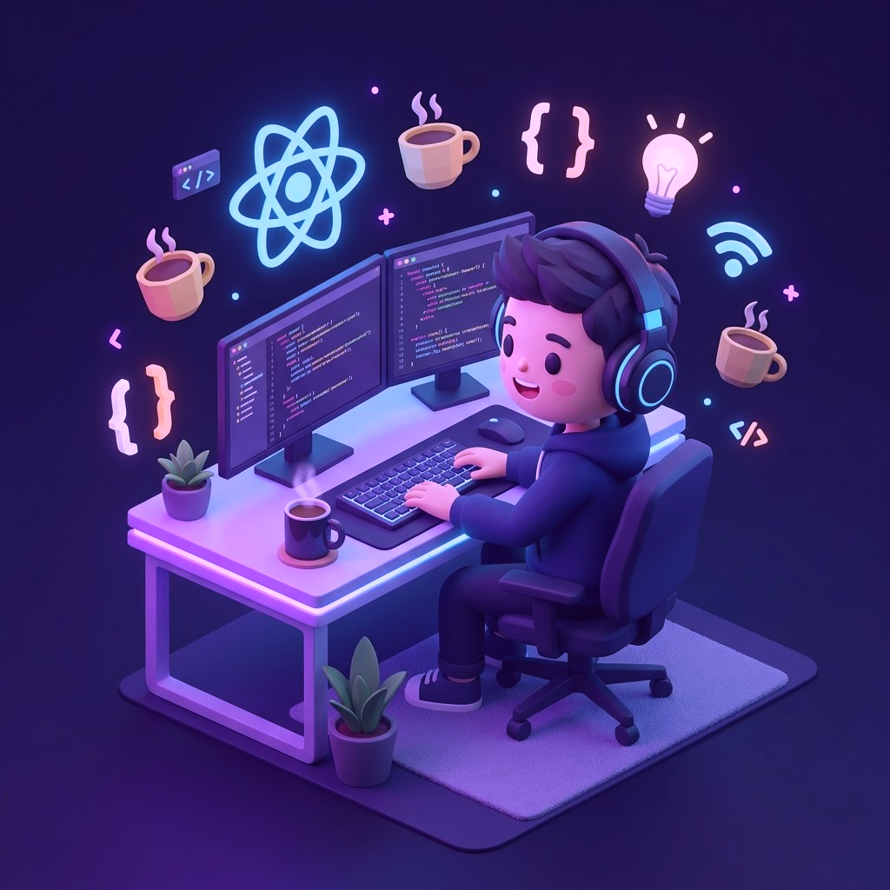

<!-- HEADER BANNER -->
<div align="center">


</div>

<!-- INTRO TABLE -->
<div align="center">

<table>
<tr>
<td align="left" width="55%">

<h2>Hey there 👋, I'm <a href="https://github.com/zero-nexora">NguyenHien</a></h2>

<h3>🚀 Full-Stack Developer</h3>

<p><em>Building real-world web applications with modern JavaScript, TypeScript & Java stacks</em></p>

<br/>

[](https://your-portfolio.com)
[](https://linkedin.com/in/your-profile)
[](mailto:nguyenhien050525@email.com)
[](https://github.com/nguyenhiennnnn)

</td>
<td align="center" width="45%">



</td>
</tr>
</table>

</div>

<!-- SKILL ICONS -->
<div align="center">

<br/>


<br/><br/>


</div>

<br/>

<!-- ABOUT ME -->
<h2> &nbsp;About Me</h2>

```yaml
name:          "NguyenHien"
role:          "Full-Stack Developer"
location:      "Vietnam 🇻🇳"
current_focus: "Building production-grade web applications"
learning:      ["System Design", "Cloud Architecture", "Advanced Spring Boot"]
fun_fact:      "I turn caffeine into code ☕→💻"
```

> 🎯 I'm a passionate full-stack developer focused on building **production-grade web applications** — from hotel booking platforms and social media networks to real-time collaborative tools. I work across the entire stack: crafting responsive UIs with **React/Next.js**, designing **RESTful APIs** and **tRPC** backends, managing relational databases, integrating third-party services (**Stripe, Cloudinary, Google Gemini AI**), and building robust backend services with **Java Spring Boot**.

<br/>


<br/>

<!-- TECH STACK -->
<h2>🛠️ Tech Stack</h2>

<table>
<tr>
<td valign="top" width="50%">

<h3 align="center">🎨 Frontend</h3>
<div align="center">


</div>

**Libraries & Tools:**
- 🧩 **UI:** shadcn/ui · Radix UI · Material UI · Framer Motion
- 📦 **State:** Zustand · TanStack Query
- 📝 **Forms:** React Hook Form + Zod
- ✍️ **Rich Text:** Quill · TipTap
- 🗺️ **Maps:** Leaflet / react-leaflet

</td>
<td valign="top" width="50%">

<h3 align="center">⚙️ Backend</h3>
<div align="center">


</div>

**Architecture & Patterns:**
- 🔐 **Auth:** JWT · OAuth 2.0 · Clerk · better-auth · NextAuth
- 📡 **API:** REST · tRPC · Server Actions
- ⏱️ **Jobs:** Upstash QStash cron
- 🚦 **Rate Limit:** Upstash Redis
- 📧 **Email:** Resend · React Email · Nodemailer

</td>
</tr>
<tr>
<td valign="top" width="50%">

<h3 align="center">🗄️ Database & ORM</h3>
<div align="center">


</div>

- 🔄 **Realtime:** Liveblocks · Supabase
- ⚡ **Caching:** Upstash Redis
- 🔍 **Search:** Elasticsearch

</td>
<td valign="top" width="50%">

<h3 align="center">🔧 DevOps & Services</h3>
<div align="center">


</div>

- 🤖 **AI:** Google Gemini API (streaming chat, captions)
- 📁 **Upload:** UploadThing · Multer + Cloudinary
- 💬 **Realtime:** Socket.IO · Liveblocks
- 🗺️ **Maps:** Leaflet / react-leaflet

</td>
</tr>
</table>

<br/>


<br/>

<!-- FEATURED PROJECTS -->
<h2> &nbsp;Featured Projects</h2>

<!-- STAYWISE -->
<details open>
<summary><h3>🏨 Staywise — Hotel Booking Platform</h3></summary>

<br/>

<div align="center">


</div>

> Full-stack hotel booking system with AI concierge, real-time map search, QR check-in, and automated email workflows.

**✨ Key Features**

- 🔍 Search hotels by city/dates/guests — **infinite scroll** + 3 view modes (list, grid, interactive map)
- 💳 Full booking flow: room selection → guest info → **Stripe payment** with 15-min expiry countdown → confetti
- 🤖 **AI Chat Concierge** — Google Gemini with streaming responses & auto language detection (EN/VI)
- 📱 **QR code check-in** — staff scan QR to validate booking
- ✉️ 8 custom **React Email** templates with parchment design system
- ⏰ **Automated cron jobs** (QStash) — expire unpaid bookings, check-in reminders, review requests
- 🔒 Race-condition-safe room locking: `AVAILABLE → LOCKED → BOOKED` state machine
- 💰 Tiered refund policy with partial Stripe refund support

<div align="center">

**Full Stack:** `Next.js 16` · `tRPC v11` · `Prisma 7` · `PostgreSQL` · `Stripe` · `Google Gemini` · `Upstash QStash/Redis` · `React Email` · `Resend` · `Leaflet` · `better-auth` · `Zustand` · `Framer Motion`

</div>

</details>

<br/>

<!-- VIRE -->
<details open>
<summary><h3>💬 Vire — Social Media Platform</h3></summary>

<br/>

<div align="center">


</div>

> Feature-rich social media app with real-time interactions, stories, AI captions, and a complete friend/follow system.

**✨ Key Features**

- 📜 Infinite-scroll feed with cursor-based pagination & real-time "new posts available" banner
- ✍️ Rich post creation — **Quill editor**, image/video uploads, **AI caption generation** (Gemini)
- 😍 Facebook-style **emoji reactions** (6 types) with hover picker and reaction summary modal
- 📖 **24-hour ephemeral stories** — full-screen auto-progress viewer
- 💬 Threaded comments with replies, edit, and delete
- 👥 Complete friend system: request, accept, reject, block + **friend suggestions** via mutual connections
- 🔔 Real-time notifications, typing indicators, online presence via **Socket.IO**
- 🔐 JWT auth with **silent token refresh** — access token in memory, refresh token in HTTP-only cookie

<div align="center">

**Frontend:** `React 19` · `Vite 8` · `TailwindCSS v4` · `shadcn/ui` · `TanStack Query` · `Zustand` · `Socket.IO Client` · `Vidstack` · `Quill`
<br/>
**Backend:** `Express 5` · `Prisma 7` · `PostgreSQL` · `Socket.IO` · `JWT + Google OAuth` · `Cloudinary` · `Upstash Redis` · `Google Gemini`

</div>

</details>

<br/>

<!-- NOTEDECK -->
<details open>
<summary><h3>📝 NoteDeck — Collaborative Project Management</h3></summary>

<br/>

<div align="center">


</div>

> Real-time collaborative note-taking and project management tool with kanban boards, live sync, and Stripe billing.

**✨ Key Features**

- 🤝 **Real-time collaboration** powered by Liveblocks
- 📋 Drag-and-drop **kanban boards** (dnd-kit)
- ✍️ Rich text editing with emoji picker
- 💳 **Stripe subscription billing**
- 📁 File uploads via UploadThing
- 🔐 **NextAuth** with email verification
- 📊 Charts and analytics dashboard (Recharts)
- 🔔 **Push notifications** (web-push)
- 🔍 **Elasticsearch**-powered search

<div align="center">

**Full Stack:** `Next.js 16` · `Drizzle ORM` · `PostgreSQL` · `Liveblocks` · `Stripe` · `NextAuth` · `UploadThing` · `dnd-kit` · `Elasticsearch` · `Recharts` · `web-push`

</div>

</details>

<br/>

<!-- JAVA SPRING BOOT -->
<details open>
<summary><h3>☕ Java Spring Boot — Backend Services</h3></summary>

<br/>

<div align="center">


</div>

> Backend RESTful API services built with Spring Boot.

<table>
<tr>
<td valign="top" width="50%">

**🔐 Identity Service**
- OAuth2 Resource Server
- **Dockerized** deployment
- **MapStruct** DTO mapping
- **JaCoCo** test coverage
- **Testcontainers** integration testing
- Spotless code formatting

</td>
<td valign="top" width="50%">

**🏪 Dream Shops API**
- Full e-commerce REST API
- Spring Data JPA + MySQL
- Spring Security + JWT
- ModelMapper DTO pattern

</td>
</tr>
</table>

<div align="center">

**Tech:** `Java 17/21` · `Spring Boot 3` · `Spring Security` · `Spring Data JPA` · `MySQL` · `JWT` · `Stripe` · `Docker` · `MapStruct` · `Testcontainers` · `Lombok`

</div>

</details>

<br/>


<br/>

<!-- HIGHLIGHTS -->
<h2>💡 Highlights & Strengths</h2>

<div align="center">

| 🏷️ Area | 💪 Demonstrated In |
|:---|:---|
| **Full-Stack Architecture** | Every major project includes both frontend & backend with well-structured codebases |
| **Payment Integration** | Stripe workflows with webhooks, refunds, and subscription billing |
| **Real-Time Systems** | Socket.IO (Vire), Liveblocks (NoteDeck) |
| **Authentication & Security** | JWT with silent refresh, OAuth 2.0, better-auth, NextAuth, Spring Security |
| **AI Integration** | Google Gemini API — streaming chat, AI-powered caption generation |
| **Database Design** | Complex relational schemas with state machines, keyset pagination, race-condition handling |
| **API Design** | tRPC, REST, Server Actions — type-safe end-to-end APIs with Zod validation |
| **Java Backend** | Spring Boot REST APIs with JPA, Security, Docker, testing (JaCoCo, Testcontainers) |
| **Developer Experience** | Consistent project structure, TypeScript everywhere, ESLint, database seeding |

</div>

<br/>


<br/>

<!-- GITHUB STATS -->
<h2>📊 GitHub Stats</h2>

<div align="center">


<br/><br/>


</div>

<br/>

<!-- SNAKE ANIMATION -->
<div align="center">

<picture>
  <source media="(prefers-color-scheme: dark)" srcset="https://raw.githubusercontent.com/zero-nexora/zero-nexora/output/github-snake-dark.svg" />
  <source media="(prefers-color-scheme: light)" srcset="https://raw.githubusercontent.com/zero-nexora/zero-nexora/output/github-snake.svg" />
  
</picture>

</div>

<br/>


<br/>

<!-- CONTACT -->
<h2>📫 Get In Touch</h2>

<div align="center">

[](mailto:nguyenhien050525@email.com)
[](https://linkedin.com/in/your-profile)
[](https://your-portfolio.com)

</div>

<br/>

<!-- FOOTER -->
<div align="center">


<br/><br/>


</div>
